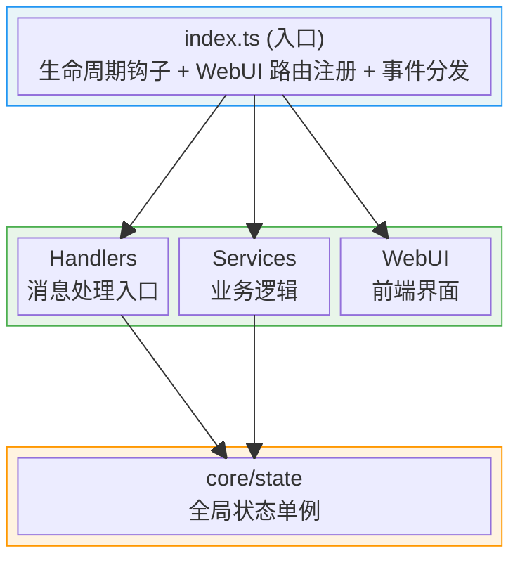
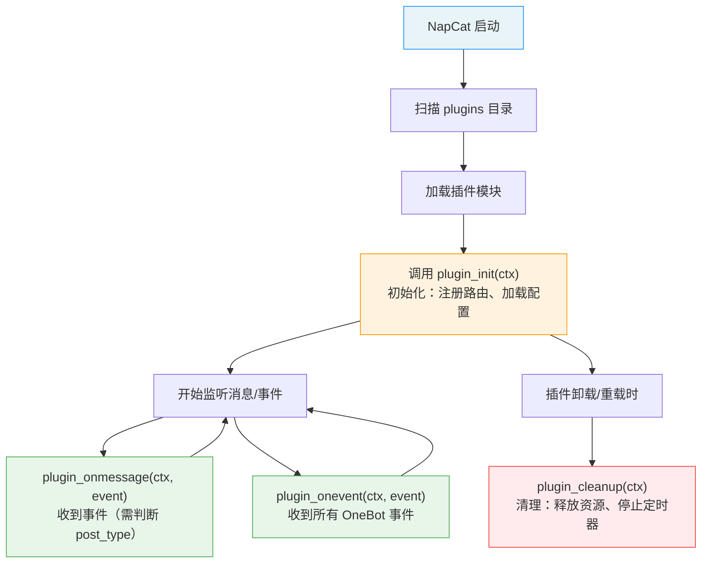

# Copilot Instructions for NapCat Plugin Template

## 目标

为 AI 编程代理提供立即可用的、与本仓库紧密相关的上下文：架构要点、开发/构建流程、约定与关键集成点，便于自动完成改进、修复与小功能。

---

## 一句话概览

这是一个面向 NapCat 的插件开发模板（TypeScript，ESM），使用 Vite 打包到 `dist/index.mjs` 作为插件入口；包含消息处理、配置管理和 WebUI 支持。

---

## 架构设计

### 分层架构



### 核心设计模式

| 模式 | 实现位置 | 说明 |
|------|----------|------|
| 单例状态 | `src/core/state.ts` | `pluginState` 全局单例，持有 ctx、config 引用 |
| 服务分层 | `src/services/*.ts` | 按职责拆分业务逻辑 |
| 配置校验 | `sanitizeConfig()` | 类型安全的运行时配置验证 |

---

## 关键文件与职责

### 入口与生命周期

| 文件 | 职责 |
|------|------|
| `src/index.ts` | 插件入口，导出生命周期钩子 (`plugin_init`, `plugin_onmessage`, `plugin_onevent`, `plugin_cleanup`) 和配置管理钩子 |
| `src/config.ts` | 默认配置 `DEFAULT_CONFIG` 和 WebUI 配置 Schema 构建 (`buildConfigSchema`) |

### 核心状态

| 文件 | 职责 |
|------|------|
| `src/core/state.ts` | 全局状态单例 `pluginState`，管理 ctx 引用、配置持久化、统计信息 |
| `src/types.ts` | TypeScript 类型定义（`PluginConfig`, `GroupConfig`, `ApiResponse`） |

### 业务服务

| 文件 | 职责 |
|------|------|
| `src/services/api-service.ts` | WebUI API 路由注册（状态、配置、群管理接口） |

### 消息处理

| 文件 | 职责 |
|------|------|
| `src/handlers/message-handler.ts` | 消息事件入口，命令解析、CD 冷却、消息发送工具 |

### 前端 WebUI

| 文件 | 职责 |
|------|------|
| `src/webui/` | React + Vite 前端项目，管理界面用于配置和状态展示 |

---

## 插件生命周期



### 生命周期函数一览

| 函数名 | 是否必选 | 说明 |
|--------|---------|------|
| `plugin_init` | 必选 | 插件加载时调用，初始化资源、注册路由 |
| `plugin_onmessage` | 可选 | 收到事件时调用（需通过 `event.post_type` 判断事件类型） |
| `plugin_onevent` | 可选 | 收到所有 OneBot 事件时调用 |
| `plugin_cleanup` | 可选 | 插件卸载/重载时调用，必须清理资源 |
| `plugin_config_ui` | 可选 | 导出配置 Schema，用于 WebUI 生成配置面板 |
| `plugin_get_config` | 可选 | 自定义配置读取 |
| `plugin_set_config` | 可选 | 自定义配置保存 |
| `plugin_on_config_change` | 可选 | 配置变更回调（reactive 字段变化时触发） |
| `plugin_config_controller` | 可选 | 配置 UI 控制器，运行时动态控制配置界面 |

---

## NapCatPluginContext 核心属性

`ctx` 是插件与 NapCat 交互的核心桥梁：

| 属性 | 类型 | 说明 |
|------|------|------|
| `ctx.actions` | `ActionMap` | OneBot11 Action 调用器（最常用） |
| `ctx.logger` | `PluginLogger` | 日志记录器（自动带插件名前缀） |
| `ctx.router` | `PluginRouterRegistry` | 路由注册器（API、页面、静态文件） |
| `ctx.pluginName` | `string` | 当前插件名称 |
| `ctx.pluginPath` | `string` | 插件所在目录路径 |
| `ctx.configPath` | `string` | 插件配置文件路径 |
| `ctx.dataPath` | `string` | 插件数据存储目录路径 |
| `ctx.NapCatConfig` | `NapCatConfigClass` | 配置构建工具类 |
| `ctx.adapterName` | `string` | 适配器名称 |
| `ctx.pluginManager` | `IPluginManager` | 插件管理器 |
| `ctx.core` | `NapCatCore` | NapCat 底层核心实例（高级用法） |
| `ctx.oneBot` | `NapCatOneBot11Adapter` | OneBot11 适配器实例（高级用法） |
| `ctx.getPluginExports` | `<T>(id) => T` | 获取其他插件的导出对象 |

---

## 开发流程

### 环境准备

```bash
# 安装依赖
pnpm install

# 类型检查
pnpm run typecheck

# 完整构建（前端 + 后端 + 资源复制）
pnpm run build
# 输出: dist/index.mjs + dist/package.json + dist/webui/

# WebUI 前端开发服务器
pnpm run dev:webui
```

### CI/CD

- `.github/workflows/release.yml`：推送 `v*` tag 自动构建并创建 GitHub Release
- `.github/workflows/update-index.yml`：Release 发布后自动 fork 索引仓库、更新 `plugins.v4.json`，通过 `push-to-fork` 向官方索引仓库提交 PR（需配置 `INDEX_PAT` Secret）
- 构建产物由 `vite.config.ts` 中的 `copyAssetsPlugin` 自动处理

---

## 编码约定

### ESM 模块规范

- `package.json` 中 `type: "module"`
- Vite 打包输出为 `dist/index.mjs`

### 类型导入

使用 `napcat-types` 包的深路径导入：

```typescript
import type { NapCatPluginContext, PluginModule, PluginConfigSchema } from 'napcat-types/napcat-onebot/network/plugin/types';
import type { OB11Message, OB11PostSendMsg } from 'napcat-types/napcat-onebot';
import { EventType } from 'napcat-types/napcat-onebot/event/index';
```

### 状态访问模式

```typescript
import { pluginState } from '../core/state';

// 通过单例访问配置
const isEnabled = pluginState.config.enabled;

// 通过单例访问日志器（等价于 ctx.logger）
pluginState.logger.info('处理消息');

// 通过单例访问上下文
const ctx = pluginState.ctx;
```

### OneBot Action 调用

统一使用 `ctx.actions.call()` 四参数模式：

```typescript
// 发送消息
const params: OB11PostSendMsg = {
    message: 'Hello',
    message_type: 'group',
    group_id: '123456',
};
await ctx.actions.call('send_msg', params, ctx.adapterName, ctx.pluginManager.config);

// 无参数 Action
await ctx.actions.call('get_login_info', void 0, ctx.adapterName, ctx.pluginManager.config);
```

### API 响应格式

```typescript
// 成功
res.json({ code: 0, data: { ... } });

// 错误
res.status(500).json({ code: -1, message: '错误描述' });
```

### 事件类型判断

```typescript
import { EventType } from 'napcat-types/napcat-onebot/event/index';

// 在 plugin_onmessage 中过滤非消息事件
if (event.post_type !== EventType.MESSAGE) return;
```

### 路由注册

```typescript
// 需要鉴权的 API → /api/Plugin/ext/<plugin-id>/
ctx.router.get('/endpoint', handler);
ctx.router.post('/endpoint', handler);

// 无需鉴权的 API → /plugin/<plugin-id>/api/
ctx.router.getNoAuth('/endpoint', handler);
ctx.router.postNoAuth('/endpoint', handler);

// 静态文件 → /plugin/<plugin-id>/files/<urlPath>/
ctx.router.static('/static', 'webui');

// 页面注册 → /plugin/<plugin-id>/page/<path>
ctx.router.page({ path: 'dashboard', title: '面板', htmlFile: 'webui/index.html' });

// 内存静态文件 → /plugin/<plugin-id>/mem/<urlPath>/
ctx.router.staticOnMem('/dynamic', [{ path: '/config.json', content: '{}', contentType: 'application/json' }]);
```

### 配置 Schema 构建

```typescript
// 使用 ctx.NapCatConfig 构建器
const schema = ctx.NapCatConfig.combine(
    ctx.NapCatConfig.boolean('enabled', '启用', true, '描述'),
    ctx.NapCatConfig.text('key', '标签', '默认值', '描述'),
    ctx.NapCatConfig.number('count', '数量', 10, '描述'),
    ctx.NapCatConfig.select('mode', '模式', [
        { label: '选项A', value: 'a' },
        { label: '选项B', value: 'b' }
    ], 'a'),
    ctx.NapCatConfig.multiSelect('features', '功能', [...], []),
    ctx.NapCatConfig.html('<p>说明</p>'),
    ctx.NapCatConfig.plainText('纯文本说明'),
);
```

---

## 注意事项

- **日志**：统一使用 `ctx.logger` 或 `pluginState.logger`，提供 `log/debug/info/warn/error` 方法
- **配置持久化**：通过 `pluginState.updateConfig()` / `pluginState.replaceConfig()` 保存
- **群配置**：使用 `pluginState.isGroupEnabled(groupId)` 检查
- **资源清理**：在 `plugin_cleanup` 中必须清理定时器、关闭连接，否则会导致内存泄漏
- **数据存储**：使用 `ctx.dataPath` 获取插件专属数据目录
- **插件间通信**：使用 `ctx.getPluginExports<T>(pluginId)` 获取其他插件的导出

---

## API 查阅方式

- **使用 AI 查询**：`.vscode/mcp.json` 中已预配置 [napcat.apifox.cn](https://napcat.apifox.cn/) 的 MCP 服务器，可在 Copilot Chat 中自然语言查询 OneBot API
- **手动查阅**：访问 https://napcat.apifox.cn/
- **开发文档**：参考 `.example/plugin/` 目录下的完整开发文档

---

## 发布流程

1. 修改 `package.json` 中的 `name`（必须以 `napcat-plugin-` 开头）、`plugin`（显示名称）、`description`、`author` 等字段
2. 配置仓库 Secret `INDEX_PAT`（GitHub PAT，需 `public_repo` 权限）
3. 推送 `v*` tag 触发自动发布：
   ```bash
   git tag v1.0.0
   git push origin v1.0.0
   ```
4. CI 自动构建 → 创建 Release → 向索引仓库提交 PR
